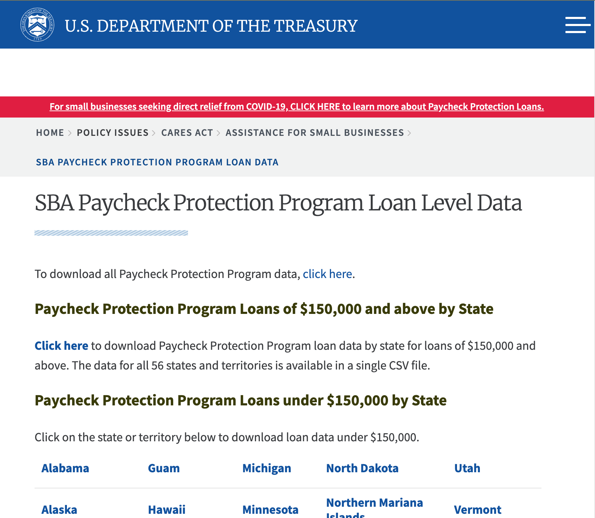

# How to navigate and wrangle the PPP Loan Data from the command-line (xsv and ripgrep)

going to try to twitch stream this. Here are some links to notes and whatever etc.

## Tools

- **ripgrep** is like grep, but faster and more flexible: https://github.com/BurntSushi/ripgrep
- **xsv** is like csvkit, but faster: https://github.com/BurntSushi/xsv

Both tools are authored by [Andrew Gallant aka BurntSushi](https://github.com/BurntSushi) and both are written in Rust, which makes them generally easier to install across any platform.

## The data

### SBA Paycheck Protection Program Loan Level Data

Here's what the landing page looks like:

Here's what the data looks like:

Landing page: https://home.treasury.gov/policy-issues/cares-act/assistance-for-small-businesses/sba-paycheck-protection-program-loan-level-data
Original source (Box Drive): https://sba.app.box.com/s/tvb0v5i57oa8gc6b5dcm9cyw7y2ms6pp
Local mirror: [ppp-150k-plus.zip](data/ppp-150k-plus.zip)

Since the actual unzipped CSV file is too big to save as-is in this repo, I've created a few sample files:

- New York PPP records: [sample.ppp-150k-plus-ny.csv](data/sample.ppp-150k-plus-ny.csv) ([on Google Sheets](https://docs.google.com/spreadsheets/d/1FaAuS4KfSCFKUW14M1EGf3WDWyb1qsPfFhybDHPzNrs/edit?usp=sharing))

### North American Industry Classification System:

Note: You can manually look NAICS codes using [naics.com](https://www.naics.com/search/), just to get a feel for what they are. But obviously you want to work from the bulk data to do anything at scale:

Landing page (census.gov): https://www.census.gov/eos/www/naics/downloadables/downloadables.html

There's a couple of files of interest:

NAICS descriptions:
- local mirror: [naics-descriptions.xlsx](data/naics-descriptions.xlsx) ([on Google Sheets](https://docs.google.com/spreadsheets/d/1495vxQnN0Q49ysZB6jB8vYiZC2TnR-t5Ph4-IAELzBg/edit#gid=1079796598))
- original source: https://www.census.gov/eos/www/naics/2017NAICS/2017_NAICS_Descriptions.xlsx

NAICS Index File:
- local mirror: [naics-index.xlsx](data/naics-index.xlsx) ([on Google Sheets](https://docs.google.com/spreadsheets/d/1ZUB3Ez5yjIiyP2kQegXKhqAHnzPczM7OjbSAomWY0EM/edit#gid=2120197161))
- csv version [naics-descriptions.csv](data/naics-descriptions.csv)
- original source: https://www.census.gov/eos/www/naics/2017NAICS/2017_NAICS_Index_File.xlsx
