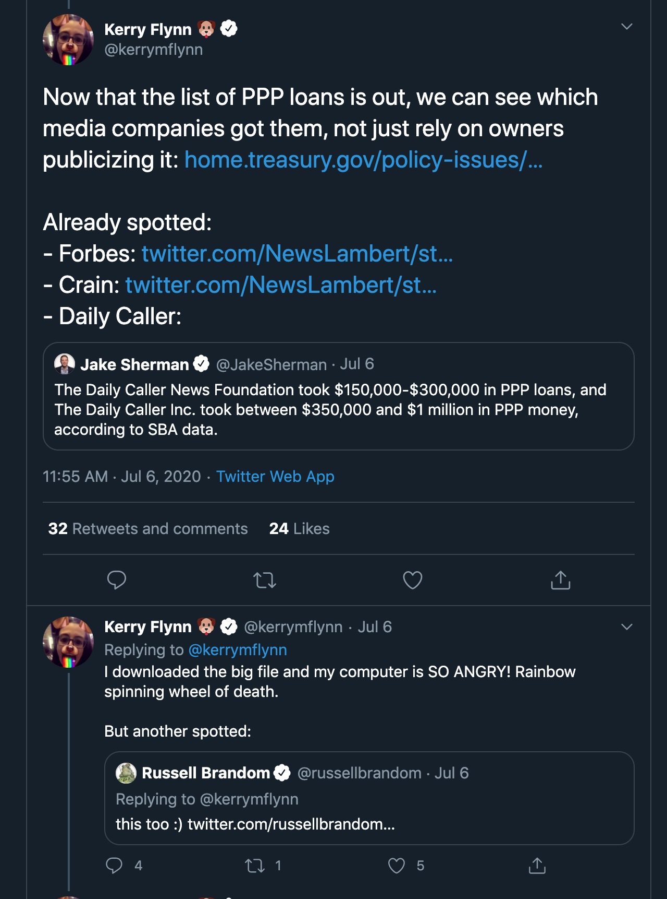
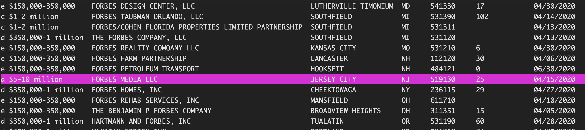

# Script/guide

Just text notes and links to help me stream


## Looking for media companies

Another category of loans that's interesting might be: *which journalism-related companies have taken loans?* News orgs are just like any other business with employees to pay, but apparently some find it controversial because of a perceived cpnflict of interest, e.g. reporters writing stories about the PPP loans. [Here's what Axios said in a press release](https://www.axios.com/axios-returns-ppp-loan-a4595591-e5fc-41a6-ba00-cc7602cc50d6.html):

> In the four weeks since Axios applied for the loan, based on big coronavirus business losses, there has been a public backlash against a variety of companies for taking the PPP, including us. Some critics say media companies like ours should not qualify, period. Others argue that venture-backed start-ups should seek capital elsewhere, even if it hurts the business.  

As with other types of businesses, news orgs have names that aren't always as straightforward as "Acme Journalism Company" or "The Springfield News Newspaper". So let's piggyback off of what others have already noticed in terms of noticeable names:


[@kerrymflynn: Now that the list of PPP loans is out, we can see which media companies got them, not just rely on owners publicizing it...](https://twitter.com/kerrymflynn/status/1280183681383043073)

<a href="https://twitter.com/kerrymflynn/status/1280183681383043073">

</a>

Examples:
- Newsweek
- Digiday Media
- Fortune Media
- Daily Caller
- Newsmax Media
- Axios ([returned the money](https://www.axios.com/axios-returns-ppp-loan-a4595591-e5fc-41a6-ba00-cc7602cc50d6.html))
- Los Angeles Magazine
- Hour Media (which owns LA Magazine, among others)

Let's see how Newsweek is shown in the records:

```sh
$ cat ppp-loans.csv | xsv search -i 'newsweek' 
```

(The `-i` flag makes it a case-insensitive search)


```
LoanRange,BusinessName,Address,City,State,Zip,NAICSCode,BusinessType,RaceEthnicity,Gender,Veteran,NonProfit,JobsRetained,DateApproved,Lender,CD
"d $350,000-1 million",NEWSWEEK MAGAZINE LLC,33 WHITEHALL ST,NEW YORK,NY,10004,541612,Corporation,Unanswered,Unanswered,Unanswered,,49,04/15/2020,"Citibank, N.A.",NY - 10
```

That's hard to read as a human so let's use `xsv select` to pick only the helpful columns:

```sh
$ cat ppp-loans.csv | xsv search -i 'newsweek' | xsv select LoanRange,BusinessName,City,State,NAICSCode,JobsRetained,DateApproved
```

We can pipe an additional command – `xsv table` – to make things look neat:

> Note: As is bash/shell conventions, I use the backslash, i.e. `\`, to add a newline to the string of commands to make it look neater. If you watch me type on stream I'll probably type it out as one big messy line
> 


```sh
$ cat ppp-loans.csv | xsv search -i 'newsweek' \
  | xsv select LoanRange,BusinessName,City,State,NAICSCode,JobsRetained,DateApproved \
  | xsv table
```


```
LoanRange             BusinessName           City      State  NAICSCode  JobsRetained  DateApproved
d $350,000-1 million  NEWSWEEK MAGAZINE LLC  NEW YORK  NY     541612     49            04/15/2020
```


Let's try a less obviously news name/keyword, like `"Forbes"`:

```sh
$ cat ppp-loans.csv \
  | xsv search -i 'forbes' \
  | xsv select LoanRange,BusinessName,City,State,NAICSCode,JobsRetained,DateApproved \
  | xsv table
```

We get a ton of irrelevant results, since there are businesspeople named 'Forbes' who have nothing to do with Forbes Media. 

However, we even get results without 'forbes' in the output:

```
LoanRange             BusinessName                City       State  NAICSCode  JobsRetained  DateApproved
d $350,000-1 million  SOLON CORPORATION           TUCSON     AZ     237130     29            04/14/2020
e $150,000-350,000    FORBES AIR CARGO INC        ALSIP      IL     484122     17            04/27/2020
e $150,000-350,000    FORBES LAW GROUP, LLC       LEAWOOD    KS     541110     8             04/06/2020
e $150,000-350,000    GREAT LAWNS, LLC            LEXINGTON  KY     561730     21            04/06/2020
e $150,000-350,000    FORBES REHAB SERVICES, INC  MANSFIELD  OH     611710                   04/10/2020
```

And the reason for that is because we did `xsv search` for `'forbes'` across *every* column – and then we piped the results into `xsv select`, which cuts out a bunch of columns, including ones that may have had 'forbes' in them, like in the `Address` field, e.g. `GREAT LAWNS, LLC` is at '146 FORBES RD'.

This is easy to fix by rearranging the order of operations – call `xsv select` *then* do `xsv search`:

```sh
$ cat ppp-loans.csv \
  | xsv select LoanRange,BusinessName,City,State,NAICSCode,JobsRetained,DateApproved \
  | xsv search -i 'forbes' \
  | xsv table
```

We can skim the list to find "FORBES MEDIA":



Let's do a bunch of examples at once, using the regular expression syntax for `OR` – a pipe: `|`:


```sh
$ cat ppp-loans.csv \
  | xsv select LoanRange,BusinessName,City,State,NAICSCode,JobsRetained,DateApproved \
  | xsv search -i 'daily caller|newsmax|digiday|fortune media|los angeles magazine|hour media' \
  | xsv table
```

### Problem: Searching for 'Magazine' returns "MAGAZINE ST"

I don't know exactly what Flynn used to search the data. But if she were using just plain text, then searching "Magazine" would return rows where "Magazine" shows up anywhere, including "MAGAZINE ST" as its address. Spreadsheets like Excel do have a way to search just within a specific column, but it can be confusing (at least to me) to set up.

https://twitter.com/kerrymflynn/status/1280201142182522881

We run into the same too-broad problem with `xsv search`, but luckily it has a flag – `-s` – that allows us to narrow the columns for a search:

```sh
$ cat ppp-loans.csv \
  | xsv search -i 'magazine' -s 'BusinessName' \
  | xsv count

47
```


(46 results)

Without limiting the text match to `BusinessName`:

```sh
$ cat ppp-loans.csv \
  | xsv search -i 'magazine' \
  | xsv count

109
```


