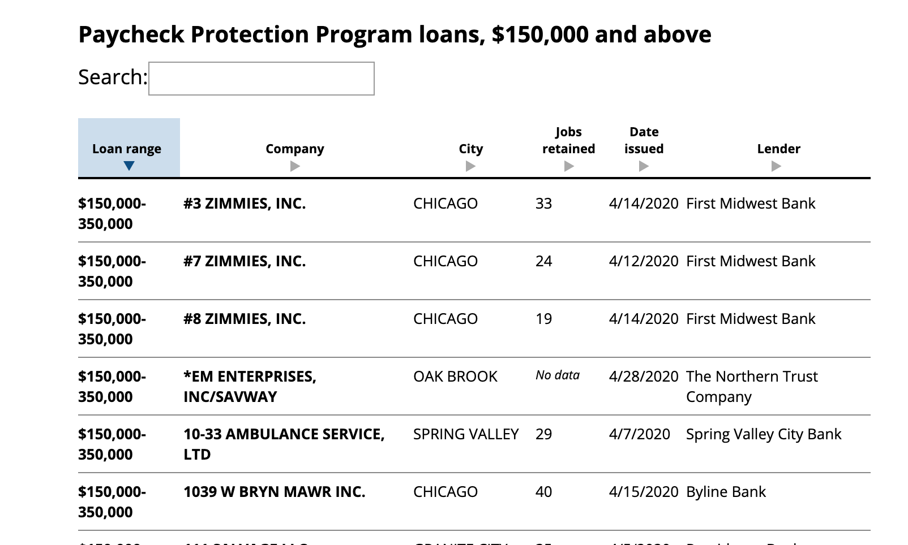

# How PPP has been reported on

Here is a non-exhaustive selection of reporting around the PPP loans.

## Interactive databases

[Explore the SBA data on businesses that received PPP loans](https://www.washingtonpost.com/graphics/2020/business/sba-ppp-data/) by Steven Rich, Joe Fox, Jake Crump and Aaron Gregg of the Washington Post

(notice what subset of records and fields they've decided were worth showing in the tabular view)

[Tracking PPP Loans: Search Every Company Approved for Federal Loans Over $150k](https://projects.propublica.org/coronavirus/bailouts/) by Moiz Syed and Derek Willis of ProPublica – this news app searches across all the records and shows summarizations by state and nationwide:

## Statewide

[From museums and restaurants to law firms and supermarkets, thousands of Chicago-area businesses got PPP loans worth $1 million or more](https://www.chicagotribune.com/coronavirus/ct-coronavirus-chicago-businesses-ppp-loans-20200706-yqzbwx4rkvaptpkonuuwuu37jq-story.html) by Robert Channick of the Chicago Tribune

> From museums and restaurants to law firms and supermarkets, nearly 4,000 Illinois businesses and nonprofits were approved for PPP loans worth $1 million or more, according to SBA data, which was published online. Others received smaller sums.

> The Brookfield Zoo, Cubs sponsor Sloan Valve, Willow Creek Church and Baird & Warner are among the 255 Illinois organizations with PPP loans between $5 million and $10 million — the most allowed under the program.

> Other well-known Chicago-area companies approved for at least $1 million in PPP loans include Rosebud Restaurants, Pete’s Fresh Market, Steppenwolf Theatre and Encyclopaedia Britannica.

The Chicago Tribune [also has an accompanying interactive database, by Chad Yoder and Jonathan Berlin](https://www.chicagotribune.com/coronavirus/ct-cb-illinois-company-ppp-loans-20200706-sgkiswpg65c6xjuwjlkr62tag4-htmlstory.html), of all the Illinois companies that are named, i.e. received $150K+:

---------

[Wealthy and well-connected Alaska firms among those gaining most from PPP](https://www.alaskapublic.org/2020/07/08/wealthy-and-well-connected-alaska-firms-among-those-gaining-most-from-ppp/) by Liz Ruskin of Alaska Public Media

> High-profile, established companies made the list, as did hundreds of smaller businesses that usher oil from the ground and keep Alaskans fed, housed and moving.

> A dozen Alaska companies got $5 million to $10 million apiece. Half of them are subsidiaries of Alaska Native Corporations...Three are privately-owned oilfield and industrial support companies...Two operate hospitals and one a telecom system

> ...Other big recipients of PPP money include JL Properties, a real estate development company in Anchorage. It is owned by two of Alaska’s wealthiest men, Jonathan Rubini and Leonard Hyde. 

-------------

[Jelly Belly and Yeezy got PPP loans. Which other California companies benefited?](https://www.latimes.com/business/story/2020-07-06/california-ppp-loan) by Sam Dean and Don Lee of the Los Angeles Times

> The majority — more than $50 billion — went to a subset of 87,000 California businesses that received loans of $150,000 or more. The largest loans, in the $5-million-to-$10-million range, went to just 647 businesses in the state. Manufacturing and construction companies received the highest percentage of those loans in California, but few parts of the economy went untouched, with money flowing to law firms, tech companies, film studios, healthcare companies, farms, hotels, restaurants and even a three-on-three basketball league founded by rapper and actor Ice Cube.

> ...The Los Angeles entertainment industry, which has seen concerts, sporting events and TV and film production delayed because of coronavirus precautions, reached for PPP loans to stave off layoffs.

> Jim Henson Co. received about $2 million in loans to keep 75 jobs, for instance, and the Gersh Agency received a top-tier loan in the $5-million-to-$10-million range to help retain 250 jobs. Culver City-based Jukin Media, which makes money on the rights to viral videos, said it applied for a $2.2-million PPP loan to cover payroll costs for its 127 full-time staff and avoid layoffs.

-------------

[Tennessee businesses have received $8.9B in federal PPP Loans](https://www.news-herald.net/news/state/tennessee-businesses-have-received-8-9b-in-federal-ppp-loans/article_26c6cc45-319f-5eba-8c7f-8e7c8efa2847.html) by Vivian Jones of The Center Square

> More than 93,000 small businesses in Tennessee have received federal loans through the Paycheck Protection Program (PPP), according to a report released this week by the U.S. Small Businesses Administration (SBA).

> The 93,292 loans granted to Tennessee businesses total more than $8.9 billion. Almost 88 percent of loans, or 82,018, were for amounts less than $150,000.

## Big local businesses

[Dozens of Tallahassee companies got $1 million or more in federal Payroll Protection loans](https://www.tallahassee.com/story/news/local/state/2020/07/08/tallahassee-car-dealers-churches-schools-get-millions-ppp-loans/5389559002/) via Jeffrey Schweers of the USA TODAY NETWORK and the Tallahasee Democrat.

> Nearly 550 Tallahassee companies received millions in loans from the federal Paycheck Protection Program (PPP) since the federal government began doling out the money in April to help businesses stay afloat during the coronavirus crisis.

> ...Recipients of the money locally include some well-known car dealerships, top-flight law firms, gourmet restaurants and major construction companies, as well as nonprofit social service agencies, churches and private schools, and even the Seminole Boosters. 

[Who got a PPP loan in Philly? Check this map and search the list](https://billypenn.com/2020/07/09/philadelphia-ppp-loan-database-searchable-federal/) by Michaela Winberg of Billy Penn.

> Courtesy of the federal government, nearly 2,500 Philly companies got more than $150k in aid — and about 14,000 spots received loans under the $150k threshold.

The story also includes data interactives, including this zipcode map from Julie Christie of Resolve Philly:

## Education

[More than $54 million in PPP loans went to small private Texas colleges and universities](https://www.texastribune.org/2020/07/07/texas-colleges-ppp-loans/) by Meena Venkataramanan of the Texas Tribune

> The recipients ranged from relatively well-known schools — Austin College, Huston-Tillotson University and the University of Dallas — to for-profit institutes and vocational schools like American College of Acupuncture & Oriental Medicine Inc. and Peloton College. None of the state's public schools or largest private schools were eligible for the loans, though they have received other forms of federal aid.

----

[Charter schools reap more than $220 million in federal coronavirus aid. Elite private schools got some, too. Here’s a database with details.](https://www.washingtonpost.com/education/2020/07/08/charter-schools-reap-more-than-220-million-federal-coronavirus-aid-elite-private-schools-got-some-too-heres-database-with-details/) by Valarie Strauss of the Washington Post.

> The Post database shows loans of more than $1 million. There are 152 separate entries of charter schools that come up in a search of the database for “charter schools.” Many of them received loans of between $1 million to $2 million, and some between $5 million and $10 million. If each school got the lowest amount of money in their loans, it would amount to more than $200 million.

-----

[A Lifeline for Higher Ed Associations](https://www.insidehighered.com/news/2020/07/10/ppp-loans-give-financial-boost-higher-ed-associations) by Lindsay McKenzie of Inside Higher Ed

> Between $20.35 million and $45.85 million in forgivable loans were approved to retain more than 1,200 jobs at 38 national higher education associations, according to an analysis by Inside Higher Ed that examined a selection of major associations receiving loans valued at more than $150,000.

The story comes with a [data viz built in DataWrapper](https://www.datawrapper.de/_/HeHCB/), which also includes a "Get the data" link: 

## Religious organizations

[Dallas’ First Baptist Church, other megachurches receive millions in PPP small-business loans](https://www.dallasnews.com/business/banking/2020/07/07/dallas-first-baptist-church-other-megachurches-receive-millions-in-ppp-small-business-loans/) via Natalie Walters of the Dallas Morning News.

> In Texas, 16 churches and two Planned Parenthoods received $2 million to $5 million in PPP loans. Loans in that range accounted for less than 0.6% of all PPP loans from the U.S. SBA.

> ...Altogether, religious organizations in Texas -- including tax-exempt churches, mosques and synagogues -- received up to $901.6 million in PPP loans to retain 110,434 jobs. The SBA released loan amounts in ranges, meaning the total loan amount was between $500.2 million and $901.6 million.

The DMN story also features an interactive table, containing many fields that are not in the PPP data, e.g. denomination and average attendance:

[Michigan churches, synagogues, mosques get millions in federal PPP loans](https://www.freep.com/story/news/local/michigan/2020/07/10/michigan-churches-synagogues-michigan-get-millions-ppp-money/5388897002/) via Niraj Warikoo of the Detroit Free Press

> The federal money has gone to organizations with a wide range of faiths — Jewish, Christian, and Muslim —  across the tri-county area, from the Catholic Archdiocese of Detroit to Jewish synagogues in Oakland County to evangelical megachurches in Detroit suburbs such as Kensington, according to a Free Press review of data released by the U.S. Treasury Department and Small Business Administration.

> ...The Archdiocese has 206 employees, Adrian Dominican Sisters has 335 employees, and Vista Maria has 324 employees, according to the PPP data released. Several other Catholic congregations, schools, or institutions in Michigan got more than $1 million.

> ...Two Jewish groups in Oakland County also each received $2 to $5 million in PPP loans, according to the data: Yeshiva Beth Yehudah, a Jewish day school in Oak Park and Southfield, and Jewish Vocational Service and Community Workshop in Southfield.

> ...In the Muslim community, some of the Islamic centers in southeastern Michigan that got loans of more than $150,000 are: the Islamic Center of America, a prominent mosque on Ford Road in Dearborn, which got a $350,000 to $1 million PPP loan; the Muslim Community Association of Ann Arbor, which also got a $350,000 to $1 million loan; the Islamic Center of Detroit on Tireman Street, which got $150,000 to $350,000, and Islamic Center of Flint-Genesee Academy in Flint, which also got $150,000 to $300,000.

## Tech companies

[Here are some of the tech start-ups that took government payroll loans during the coronavirus crisis](https://www.cnbc.com/2020/07/06/ppp-loans-to-tech-start-ups-bird-mixpanel-grindr-on-the-list.html) by Jessica Bursztynsky of CNBC.

[Here’s a list of tech companies that the SBA says took PPP money](https://techcrunch.com/2020/07/06/heres-a-list-of-tech-companies-that-the-sba-says-took-ppp-money/) by Kirsten Korosec and Natasha Mascarenhas of TechCrunch

[Tech companies, research institutes cash in on federal loan program](https://www.paloaltoonline.com/news/2020/07/08/tech-companies-research-institutes-cash-in-on-federal-loan-program) by Gennady Sheyner, Kevin Forestieri and Lloyd Lee of the Palo Alto Weekly.

Exhaustive coverage from the local weekly, including a link to a [Google Sheet](https://docs.google.com/spreadsheets/d/1SX-iJMqv216WH2yCSflae4Pgx-p0kNjLh9zYnnHb2fI/edit#gid=397673173 and [PDF version] of the filtered data. While the story isn't just about tech companies, their coverage area obviously includes many tech companies:

> Among the diverse recipients were Izzy's Brooklyn Bagels, a Palo Alto eatery that has received a loan of between $150,000 and $350,000, and Adara Inc., a marketing company on East Meadow Circle that specializes in traveler data and that received a loan in the $2 million to $5 million range. The list also includes the car dealer Magnussen's Imports (between $1 million and $2 million) in Palo Alto and Ellison Towing in Mountain View ($350,000 to $1 million).

> The SETI Institute, a Mountain View-based organization dedicated to searching for extraterrestrial life, also received a loan. Bill Diamond, president and CEO of SETI Institute, said the amount was $2.4 million. Many of the institute's scientists work in research labs in NASA Ames Research Center in Mountain View, which has been shut down since mid-March, he said in an email.

