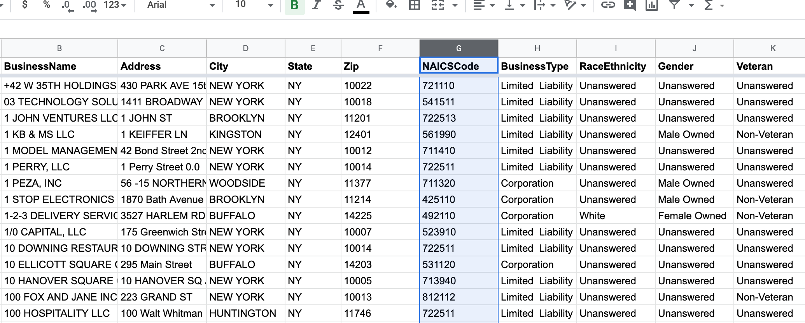
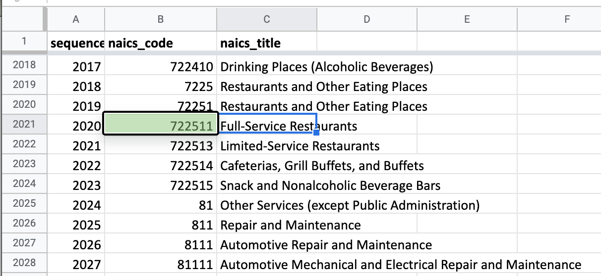
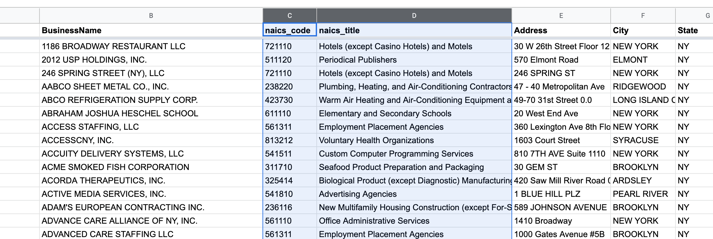

# Using xsv join

> **Note** for the majority of this lesson I will be referring to a file named `ppp-coded.csv`, which is like the original `ppp-loans.csv` data, except with an extra column for NAICS human-readable title, based on the corresponding value in the `NAICSCode` column:
> 
> - example of original [ppp-loans.csv](https://docs.google.com/spreadsheets/d/1FaAuS4KfSCFKUW14M1EGf3WDWyb1qsPfFhybDHPzNrs/edit#gid=518711005) data
> - example of [ppp-coded.csv](https://docs.google.com/spreadsheets/d/1gvujFmMTm1l2Q_ivgYmAa3DFZp_f_62BcPjSzQUN6ZE/edit#gid=518711005) data
> 
> This section describes how I created `ppp-coded.csv` from `ppp-loans.csv`


The PPP data comes with a `NAICSCode` column, which is what we use for (kind of) categorizing the loan applicants. Here's what it looks like:



However, most of us don't have memorized what those 6-digit codes correspond to. So for every code we want to know about, we manually look up on [naics.com/search](naics.com/search) or look it up on the [official spreadsheet of codes](https://docs.google.com/spreadsheets/d/1AkKFHJb1GSOmPTzNyPsg3swulqbmwm8hGZVW0J-5tk8/edit#gid=1223701275) from the Census Bureau. Here's what that spreadsheet looks like:



Obviously doing these lookups is very annoying if you're doing more than a handful. For the purposes of data exploration, Wouldn't it be nice if the human-readable "title" for each code was a column in the PPP loan data, like this?



Because real-world data is often only usable when joining it with other reference data/tables, I'm usually doing SQL pretty early in the data exploration and wrangling process. For example, to create the joined data as seen in the previous screenshot, I'd import the CSV files of PPP loans and NAICS codes into a SQLite database. And then I'd execute a query like this:

```sql
SELECT *
FROM ppp_loans
LEFT JOIN naics_codes
    ON ppp_loans.NAICSCode = naics_codes.naics_code;
```

But luckily for us, we don't have to jump into SQL just yet. Because the `xsv join` function can perform this kind of simple single-column join between 2 files:


```
Usage:
    xsv join [options] <columns1> <input1> <columns2> <input2>
```

> Here's a nice writeup by John D. Cook: https://www.johndcook.com/blog/2019/12/31/sql-join-csv-files/


So this is the `xsv join` ccommand for joining `ppp-loans.csv` and `naics-codes.csv` on their respective NAICS code columns:

```sh
$ xsv join --left 'NAICSCode' ppp-loans.csv \
        'naics_code' naics-codes.csv \
    > ppp-coded.csv
```

The resulting file, `ppp-coded.csv`, looks the same as `ppp-loans.csv`, except it will have two new columns appended: `naics_code` and `naics_title` (note that `NAICSCode` from `ppp-loans.csv` is part of this table, even though it's theoretically the same as the `naics_code` from `naics-codes.csv`)

However, to make data exploration life a little easier, we want those 2 new columns next to the `BusinessName` column, so I use `xsv select` and some of its fancier syntax for column references to rearrange things as I like:


```sh
$ xsv join --left 'NAICSCode' ppp-loans.csv \
        'naics_code' naics-codes.csv \
    | xsv select 'LoanRange,BusinessName,naics_code,naics_title,Address-CD' \
    > ppp-coded.csv
```

A sample of that resulting join can be found on Google Sheets: https://docs.google.com/spreadsheets/d/1gvujFmMTm1l2Q_ivgYmAa3DFZp_f_62BcPjSzQUN6ZE/edit#gid=518711005
